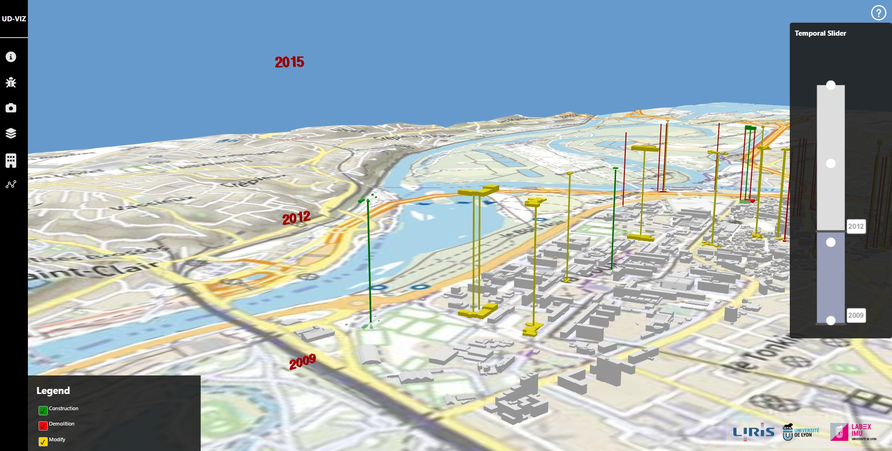

# Morphogenèse urbaine : Définition du projet 

* [Aim of the project](#aim-of-the-project)



This project is part of action 14 (Think and do Tank) of the [TIGA project](https://www.tank-ssi.org/) led by the Metropole of Lyon. It aims to set up a partnership between two research laboratories involved in the Think and do Tank: the Image and Information Systems Computing Laboratory ([LIRIS](https://liris.cnrs.fr/)) and the Environment, City and Society Laboratory ([EVS](https://umr5600.cnrs.fr/fr/accueil/)). Organised within the [LabEx IMU](https://imu.universite-lyon.fr/), the urban morphogenesis project seeks to initiate a cross-disciplinary approach to urban issues by mobilising research players for the benefit of local authorities and citizens.  

## Aim of the project  

The aim of the urban morphogenesis project is to develop a digital tool, in the form of a web interface, to visualise in 3D the evolution of the urban form of the Lyon metropolitan area over the period 1950-2020. The aim is to visualise changes linked to changes in industrial work. The aim will be to observe how the development of industry has transformed the Lyon metropolitan area by showing how urban forms have changed and emerged to deal with the problems associated with changes in work.  

This modelling shows that there is a degree of stability for businesses in the area, but at the same time industry has changed, particularly in the city centre.     

À l’aide de scénarii, L’utilisateur de la plateforme pourra se déplacer au-dessus de la Métropole à une période choisie et observer les transformations de la ville. Selon son profil, l’utilisateur n’aura pas accès aux mêmes fonctionnalités. Un utilisateur « profane » sera davantage guidé dans son parcours sur la plateforme qu’un utilisateur « expert ». L’interface proposera aux utilisateurs, différentes story map racontant l’histoire d’un territoire précis : son évolution matérielle et immatérielle. Les transformations mises en lumière par cette plateforme numérique seront les suivantes : 

 - Apparition/Disparition des bâtiments de la Métropole de Lyon sur la période considérée ; 

 - Transformation de la voirie ; 

 - Transformation des usages du bâti ; 

 - Description de certains bâtiments/lieux ; 

- Possibilité de voir la transformation de certains bâtiments/lieux à travers des photographies avant/après ; 

 - Sur des quartiers définis : transformation précise de la morphologie urbaine du quartier sur la période considérée (transformations des tracés, des tissus urbains, évolution démographique etc.).  

Ce projet est l’occasion de (re)questionner les visualisations temporelles 3D d’un territoire. Au-delà des variations des bâtiments, c’est également les fonctions internes à ceux-ci que nous voulons montrer. Visualiser l’évolution du territoire sous toutes ses formes, permet de 

prendre conscience de l’évolution subtile, ou non, de certains quartiers. C’est alors, qu’au-delà d’une simple interface web, se dessine un outil d’aide à la décision, grâce au passé, se dessine le futur. 

## Acteurs du projet  
### Conception et développement du projet : 

 - Clarisse Aubert, Ingénieure en géomatique, LabEx IMU ; 

 - Corentin Gautier, Ingénieur d’Étude en développement informatique, LabEx IMU, LIRIS ; 

 - Éléonore Gendry, Doctorante en sciences sociales, LabEx IMU, EVS. 

### Encadrement, validation du projet : 

- Gilles Gesquière, Directeur du LabEx IMU ; 

- Véronique Tessier, Chargée de mission, TIGA – Action 14 ; 

- Jean-Yves Toussaint, Responsable Scientifique et Technique du LabEx IMU. 

## Installing and running this demonstration
### Strabon-context
To configure the demo and the components that support it edit the `.env` [file](./.env) to be launched with docker-compose. By default the following ports are used by the following services:
- 8996: `PostGIS`
- 8997: `Strabon`

### Build Images and run containers
First, build the PostGIS and Strabon docker images and run their containers:
```
docker-compose up
```

**Note:** Make sure to set the `sparqlModule/url` port in the `./assets/config/server/sparql_server.json` file to the same port for the _Strabon_ container declared in the `.env` file.

### Launch UD-Viz demo
Then install and run the UD-Viz application:
```
npm i
npm run debug
```
